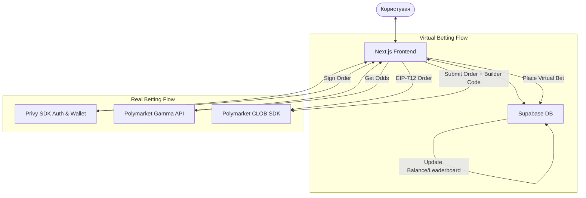

# Специфікація CupPredict (Design Document)

**Дата:** 21 травня 2026 року  
**Статус:** Затверджено  
**Ціль:** Запуск спортивної prediction-платформи поверх Polymarket під ЧС-2026 з гібридною бізнес-моделлю (демо-гра + реальні ставки).

---

## 1. Загальний опис та цілі

**CupPredict** — це Web3-платформа для спортивних ставок на базі ліквідності Polymarket, орієнтована на широку футбольну аудиторію ЧС-2026. Продукт вирішує дві основні проблеми класичного Polymarket: складний «крипто-інтерфейс» та гео-блокування/бар'єри входу для Web2 користувачів.

### Ключові цілі MVP:
1. Запустити мобільно-орієнтований UI, що нагадує FlashScore/класичних букмекерів.
2. Реалізувати гібридну модель:
   * **Демо-режим (віральний маркетинг):** користувачі роблять ставки на безкоштовні віртуальні поінти (`CupPoints`), змагаються у Leaderboard і діляться результатами в соцмережах.
   * **Реальний режим (монетизація):** користувачі купують USDC з карти (via Stripe/MoonPay) і роблять реальні ставки на Polymarket через реферальний Builder Code (ми заробляємо до 1% з кожного ордера).

---

## 2. Архітектура системи

Система побудована на базі 3 основних компонентів:
1. **Frontend:** Next.js (App Router, React, Tailwind CSS), розгорнутий на Vercel.
2. **Backend / Database:** Supabase (PostgreSQL) для збереження профілів, віртуальних балансів, історії демо-ставок та реал-тайм лідерборду.
3. **Onboarding & Web3 Layer:** Privy SDK для авторизації через Web2 (Google/Apple/Email) та автоматичного створення Embedded Wallets, а також інтеграція з Polymarket CLOB SDK для проведення реальних транзакцій.



---

## 3. Схеми даних та конфігурація

### 3.1. Конфіг матчів (`matches.json`)
Файл розміщується у репозиторії фронтенду та містить розклад матчів та їх зв'язок з Polymarket.

```json
[
  {
    "id": "wc2026-match-01",
    "stage": "Груповий етап, Група A",
    "date": "2026-06-11T20:00:00Z",
    "homeTeam": "Мексика",
    "awayTeam": "США",
    "homeFlag": "/flags/mexico.png",
    "awayFlag": "/flags/usa.png",
    "polymarket": {
      "marketId": "0x123456789abcdef",
      "conditionId": "0xabcdef123456789",
      "homeTokenId": "11111",
      "awayTokenId": "22222"
    },
    "status": "scheduled",
    "result": null
  }
]
```

### 3.2. Схема бази даних Supabase (SQL)

#### Таблиця `profiles`
```sql
create table public.profiles (
  id uuid references auth.users on delete cascade primary key,
  wallet_address text unique not null,
  username text,
  avatar_url text,
  virtual_balance numeric(12, 2) default 1000.00,
  created_at timestamp with time zone default timezone('utc'::text, now()) not null
);
```

#### Таблиця `virtual_bets`
```sql
create table public.virtual_bets (
  id uuid default gen_random_uuid() primary key,
  profile_id uuid references public.profiles(id) on delete cascade not null,
  match_id text not null,
  prediction text not null,        -- 'home', 'away', 'draw'
  odds numeric(5, 2) not null,     -- На момент ставки
  amount numeric(12, 2) not null,
  status text default 'pending',   -- 'pending', 'won', 'lost'
  payout numeric(12, 2) default 0.00,
  created_at timestamp with time zone default timezone('utc'::text, now()) not null
);
```

---

## 4. Логіка розрахунку віртуальних ставок (Settlement Engine)

1. Після завершення матчу адміністратор оновлює статус матчу в `matches.json` (встановлює `status: "finished"`, `result: "home"` або `"away"` / `"draw"`).
2. Запускається серверна процедура (Edge Function або SQL тригер), яка:
   * Отримує всі `virtual_bets` для цього `match_id` зі статусом `pending`.
   * Для виграшних ставок оновлює статус на `won` та нараховує `payout = amount * odds` на баланс користувача в `profiles`.
   * Для програшних ставок оновлює статус на `lost` та встановлює `payout = 0`.
3. Оновлення балансів миттєво перераховує таблицю лідерів (Leaderboard).

---

## 5. Інтерфейс та сторінки додатку (UI Specs)

Дизайн платформи виконано в **темній темі (Dark Mode)** з неоново-зеленими акцентами (стиль спорт-арени/кіберспорту).

### 5.1. Головна сторінка (Dashboard)
* **Верхня панель:** Логотип, кнопка профілю, перемикач режимів `Демо (🟢)` / `Реал (🔵)`, баланс.
* **Календар матчів:** Горизонтальний скрол дат матчів.
* **Список матчів:** Картки з командами, часом гри, та великими кнопками швидкої ставки: **[ 1 ]**, **[ X ]**, **[ 2 ]** з коефіцієнтами.
* **Швидка ставка (Bottom Drawer):** Виїжджає при натисканні на коефіцієнт. Дозволяє обрати суму (50, 100, 500, All-in) та зробити ставку в 1 клік.

### 5.2. Портфоліо користувача (My Bets)
* Список відкритих (активних) та закритих (історія) ставок.
* Показує поточну зміну вартості ставки (P&L).
* **Кнопка "Cash Out" (Продати):** для реальних ставок викликає функцію продажу токенів на Polymarket CLOB; для демо-ставок розраховує виплату на основі поточного коефіцієнта на ринку.

### 5.3. Leaderboard
* Топ-100 користувачів за балансом `CupPoints`.
* Кнопка "Поділитись результатом" — генерація зображення картки з рекордом для постингу у Twitter/Telegram.

---

## 6. План та етапи реалізації

### Етап 1: Підготовка та Базовий UI (Дні 1-4)
* Реєстрація в Builder Program на Polymarket.
* Ініціалізація Next.js проекту з Tailwind CSS.
* Створення базової структури сторінок та компонентів UI (Головна, Список матчів, Навігація).
* Налаштування JSON-файлу розкладу матчів.

### Етап 2: Інтеграція Privy та Supabase (Дні 5-8)
* Підключення Privy для реєстрації та створення гаманців.
* Налаштування Supabase (створення таблиць `profiles` та `virtual_bets`).
* Реалізація логіки віртуальних ставок (списання балансу, збереження ставки).
* Створення сторінки профілю користувача та Leaderboard.

### Етап 3: Розрахунок результатів та реал-тайм лідерборд (Дні 9-11)
* Реалізація адміністраторської панелі (або скрипту) для оновлення результатів матчів та запуску settlement engine.
* Тестування автоматичного нарахування виграшів.
* Реалізація логіки «Cash Out» для демо-режиму.

### Етап 4: Інтеграція Polymarket CLOB та Real Betting (Дні 12-16)
* Підключення `@polymarket/clob-client-v2` на фронтенді.
* Реалізація підпису ордерів через Privy Embedded Wallet.
* Інтеграція реферального `builderCode` для нарахування комісії.
* Інтеграція Stripe/MoonPay через Privy для купівлі USDC з картки.

### Етап 5: Полірування, Тестування та Реліз (Дні 17-21)
* Тестування інтерфейсу на мобільних пристроях.
* Виправлення багів, оптимізація швидкості завантаження.
* Деплой на Vercel та підключення домену.
* Запуск маркетингової кампанії (Telegram/Twitter).
