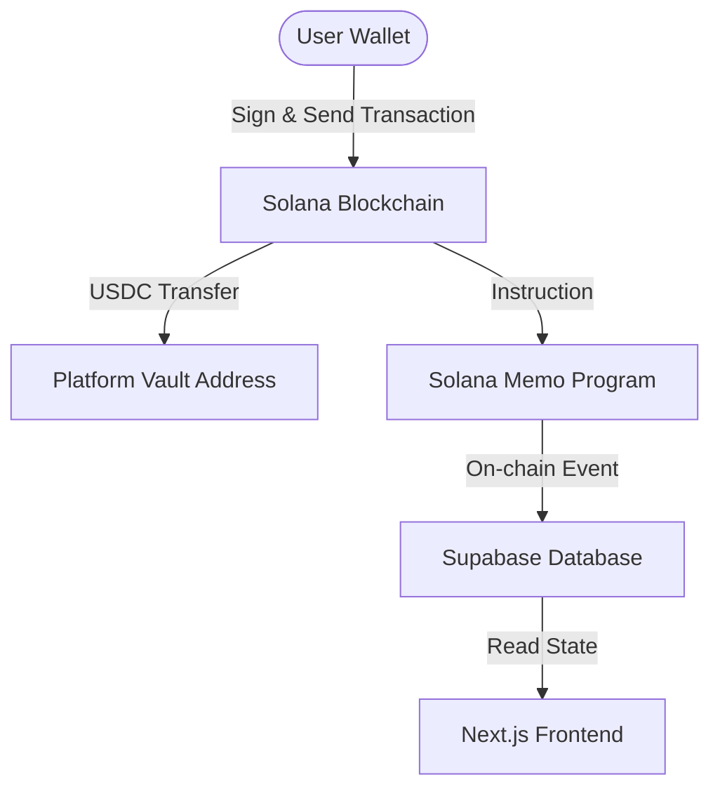

# Specification: Solana Rebuild (USDC + Memo Vault Architecture)

**Date:** May 23, 2026  
**Status:** Approved  
**Author:** Antigravity  

---

## 1. Background & Goals

Currently, the CupPredict system is coupled with the **Polygon (EVM) blockchain** and the **Polymarket CLOB SDK** for handling real-money transactions. While Polymarket has high liquidity, it imposes significant regional restrictions (geoblocking) and utilizes Ethereum-style wallets.

To improve capital efficiency, lower transaction fees, and open the platform to global users without EVM constraints, we are migrating the backend ledger and wallet layers to the **Solana blockchain**.

### Goals of the Solana Rebuild:
- **Solana Wallet Integration:** Configure Privy to provision Solana embedded wallets natively (via Google, Apple, or email logins).
- **On-chain Memo Protocol:** Establish a non-custodial betting flow where USDC is sent to a central platform vault address with an associated Solana Memo instruction identifying the prediction parameters (match, choice, odds).
- **Data & UI Synchronization:** Clean up the codebase to remove EVM-specific attributes (`conditionId`, `tokenIds`) and transition to Solana formats (base58 addresses, SPL token transfers).

---

## 2. Proposed Solana Architecture



### 2.1. On-Chain Betting Mechanics (Memo Layout)
When a user places a bet in "Real Mode", the frontend constructs a transaction containing two instructions:
1. **USDC SPL Token Transfer:** Sends `$X` USDC from the user's embedded wallet to the platform vault address.
2. **Solana Memo Program (`Memop1UFrg56g6SgoH7Z4Y8j169N6yL131V417`):** Appends a string layout containing metadata:
   `cup_predict:matchId:prediction:odds`
   *Example:* `cup_predict:wc2026-match-01:home:1.85`

Our backend processes these transactions off-chain via webhooks/indexer, validates details, and updates the profile bets state in Supabase.

---

## 3. Detailed File Changes

### 3.1. [NEW] [solana.ts](file:///Users/HarnykBohdan/Desktop/PolPredict/src/lib/solana.ts)
Replaces [polymarket.ts](file:///Users/HarnykBohdan/Desktop/PolPredict/src/lib/polymarket.ts) (which will be deleted).
- Exports `solanaService` containing:
  - `getOdds(matchId, marketId)`: Fetches match odds (simulated locally, derived from baseline prices).
  - `placeRealBet(privyProvider, args)`: Creates a Solana transaction, adds the SPL USDC transfer instruction, adds the Memo instruction, and prompts the user to sign/send via the Privy Solana provider. In mock mode, it simulates a transaction hash.

### 3.2. [DELETE] [polymarket.ts](file:///Users/HarnykBohdan/Desktop/PolPredict/src/lib/polymarket.ts)
Remove the EVM/Polymarket file from the codebase.

### 3.3. [MODIFY] [matches.json](file:///Users/HarnykBohdan/Desktop/PolPredict/src/config/matches.json)
Remove Polymarket specific `homeTokenId`, `awayTokenId`, and `conditionId`. Keep `marketId` as a general identifier.

### 3.4. [MODIFY] [providers.tsx](file:///Users/HarnykBohdan/Desktop/PolPredict/src/app/providers.tsx)
- Update Privy configuration in `Providers` wrapper to initialize `solana` embedded wallets instead of `ethereum`:
  ```typescript
  embeddedWallets: {
    solana: {
      createOnLogin: 'users-without-wallets',
    },
  }
  ```
- Change local mock wallet address to a Solana-compliant base58 format: `Solanapredict111111111111111111111111111111` instead of `0xabc123...`.

### 3.5. [MODIFY] [page.tsx](file:///Users/HarnykBohdan/Desktop/PolPredict/src/app/page.tsx)
- Update imports: change `@/lib/polymarket` to `@/lib/solana` and rename `polymarketService` to `solanaService`.
- Replace UI text references: e.g. "USDC Wallet (Polygon)" -> "USDC Wallet (Solana)".
- Clean up match card details rendering (avoid reading EVM token ids).

### 3.6. [MODIFY] [supabase.ts](file:///Users/HarnykBohdan/Desktop/PolPredict/src/lib/supabase.ts)
- Update default mock profiles in local database seed to use Solana format base58 addresses.

---

## 4. Verification Plan

### 4.1. Automated Verification
- Run typescript compilation checks:
  ```bash
  npm run build
  ```

### 4.2. Manual Verification
- Verify that `Sign In` under mock mode yields a Solana base58 wallet address in the profile indicator (`Solana...`).
- Verify that demo betting works and correctly updates the `localStorage` Supabase emulation.
