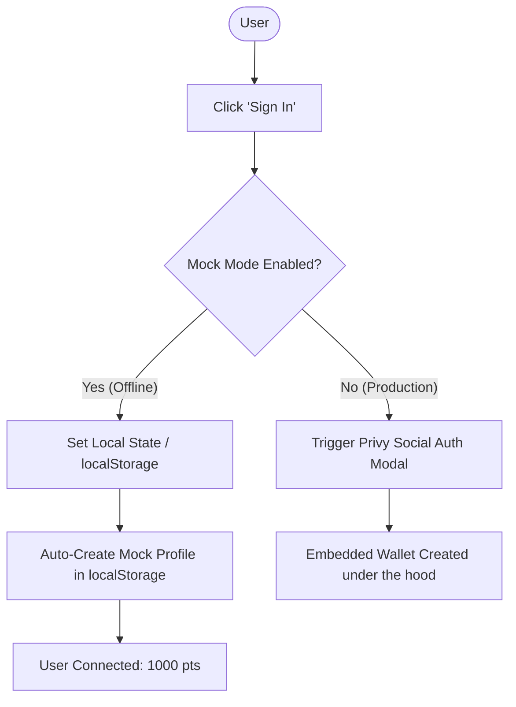

# Specification: Web2 Onboarding, Mock Authentication, and World Cup 2026 Schedule Updates

**Date:** May 23, 2026  
**Status:** Approved  
**Author:** Antigravity  

---

## 1. Background & Goals

Currently, the CupPredict prototype suffers from three distinct limitations:
1. **Invalid Auth Setup:** The Privy App ID configured in `.env.local` is a placeholder (`clh123...`). This causes Privy SDK to throw initialization errors, making it impossible to click "Sign In" to test either Demo or Real mode.
2. **Outdated Match Data:** The matches defined in `matches.json` are dummy matches (e.g. Mexico vs USA on Day 1) which do not align with the real FIFA World Cup 2026 draw.
3. **Web2 User Barriers:** Traditional Web3 onboarding (seed phrases, browser extensions) is too complex for general football fans. We need a clear path to bring Web2 fans into both Demo and Real modes.

### Goals of this Sub-Project:
- **Bypass Auth Blockers locally:** Create a robust "Offline Mock Mode" for authentication in `providers.tsx`. When `NEXT_PUBLIC_USE_MOCK_DATA` is `true`, the application will use simulated login/logout states stored in `localStorage`, letting the user test prediction submissions, leaderboard entries, and active portfolios instantly.
- **Synchronize Schedule with Real Draw:** Overwrite `matches.json` and mock odds in `polymarket.ts` to reflect the opening matches of the World Cup 2026.
- **Define Web2 Onboarding Architecture:** Solidify the "Invisible Web3" approach utilizing Privy social connections and Stripe USDC card purchase flows.

---

## 2. Proposed Architectural Changes

### 2.1. Offline Mock Authentication Flow
When `NEXT_PUBLIC_USE_MOCK_DATA=true` is set:
- Bypasses the active network requests of `usePrivy()`.
- Generates a local simulated user session on click of "Sign In" with wallet address `0xabc1234567890123456789012345678901234567`.
- Persists session in `localStorage` under `cuppredict_mock_auth`.
- Keeps state in sync with profiles and virtual bets in Supabase mock database.



### 2.2. World Cup 2026 Match Schedule (Group Stage Opening Week)
The first 6 matches will be updated to align with the real FIFA World Cup 2026 group stage schedule:

1. **Mexico vs South Africa** (Group A, 2026-06-11)
2. **Korea Republic vs Czechia** (Group A, 2026-06-12)
3. **Canada vs Bosnia and Herzegovina** (Group B, 2026-06-12)
4. **USA vs Paraguay** (Group D, 2026-06-13)
5. **Qatar vs Switzerland** (Group B, 2026-06-13)
6. **Brazil vs Morocco** (Group C, 2026-06-13)

---

## 3. Detailed File Changes

### 3.1. [matches.json](file:///Users/HarnykBohdan/Desktop/PolPredict/src/config/matches.json)
Update teams, stages, date/time timestamps, flags, and names.

### 3.2. [polymarket.ts](file:///Users/HarnykBohdan/Desktop/PolPredict/src/lib/polymarket.ts)
Update mock base prices variable mapping keys (`wc2026-match-01` to `wc2026-match-06`) to correspond to the updated real teams.

### 3.3. [providers.tsx](file:///Users/HarnykBohdan/Desktop/PolPredict/src/app/providers.tsx)
Integrate local state bypass for `authenticated`, `walletAddress`, `login`, `logout` and `ready` properties.

---

## 4. Verification & Testing Plan

### 4.1. Automated Verification
- Run production bundle compilation check:
  ```bash
  npm run build
  ```

### 4.2. Manual Walkthrough
1. Run local dev server.
2. Click **Sign In**. Observe instant mock-wallet login.
3. Check the header to confirm the profile balance says `1000.00 pts`.
4. Check the Matches list to confirm the opening games (Mexico vs South Africa, etc.) are rendered.
5. Place a Demo bet on Mexico. Observe confetti, deduction of points from balance, and correct entry in the Portfolio tab.
